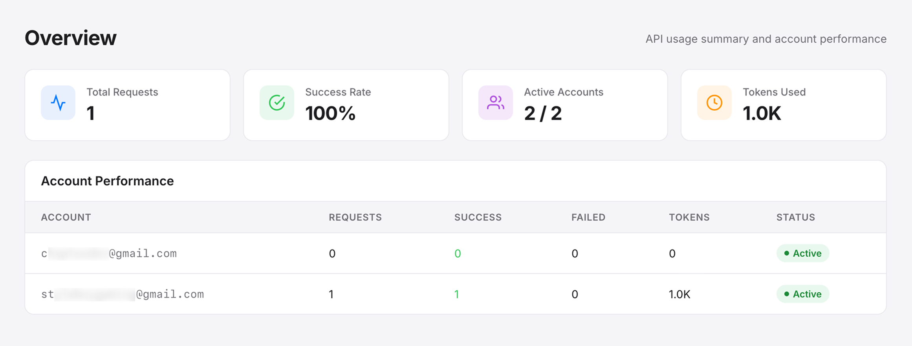
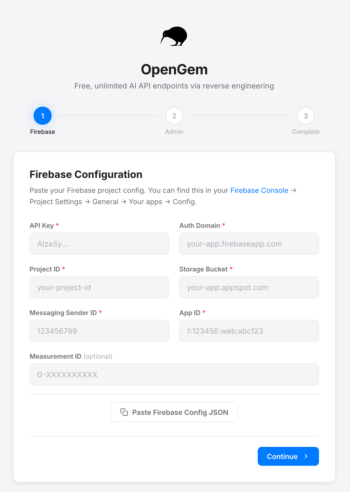
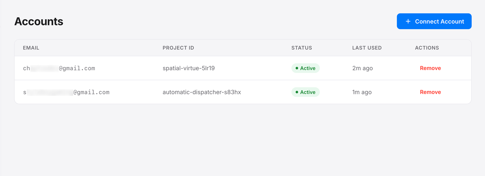
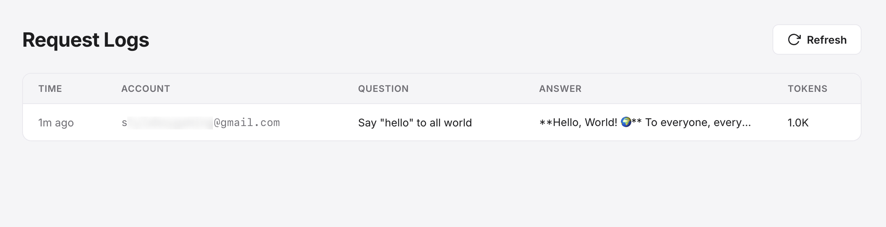

<div align="center">

<picture>
  <source media="(prefers-color-scheme: dark)" srcset="public/logos/white.png">
  
</picture>

# OpenGem

**Free, Unlimited AI API Gateway via Gemini API Reverse Engineering**

[](LICENSE)
[](https://nodejs.org)
[](https://typescriptlang.org)

Transform any standard **Google Account** into a free AI API endpoint. OpenGem uses reverse-engineered Gemini CLI credentials to access Google's free-tier Gemini API, providing a standard `POST /v1beta/models/{model}:generateContent` interface that works natively with official Google Gen AI SDKs.

[Quick Start](#quick-start) · [How It Works](#how-it-works) · [API Usage](#api-usage) · [Admin Dashboard](#admin-dashboard)

</div>

---

## What is OpenGem?

OpenGem is an open-source proxy and API gateway designed to grant developers free, load-balanced access to Google's Gemini models. By operating an intelligent multi-account load balancer, OpenGem seamlessly handles rate limits and quota 429 exhaustions, automatically rotating active Google accounts to ensure uninterrupted service.

## Core Features

| Feature | Description |
|---------|-------------|
| **Completely Free Access** | Leverages Google's free-tier Gemini API using reverse-engineered credentials. |
| **Smart Load Balancing** | Automatically rotates across multiple Google accounts when a quota limit (429) is hit. |
| **Standardized API** | Native `v1beta` models endpoint compatibility. Works perfectly with `@google/genai` and `google-genai` SDKs. |
| **Dynamic API Keys** | Generate and manage unlimited API keys securely from the admin dashboard. |
| **Usage Dashboard** | Real-time statistics, account performance monitoring, and detailed request log tracking. |
| **One-Click Setup** | Intuitive, browser-based setup wizard requiring no manual configuration files. |
| **Secure by Default** | Built with JWT authentication, rate limiting, and Helmet.js security headers. |
| **Auto Recovery** | Exhausted Google accounts auto-reactivate seamlessly after a 60-minute cooldown period. |
| **Firebase Powered** | Zero-configuration database implementation using Firebase Firestore. |

<div align="center">

</div>

---

## Quick Start

### Prerequisites
- [Node.js](https://nodejs.org) v18 or higher
- A [Firebase](https://console.firebase.google.com) project (the free tier is sufficient)
- At least one active Google account

### Installation

```bash
# Clone the OpenGem repository
git clone https://github.com/arifozgun/OpenGem.git
cd opengem

# Install project dependencies
npm install

# Start the development server
npm run dev
```

Navigate to `http://localhost:3050` in your web browser. The **Setup Wizard** will automatically guide you through:
1. **Firebase Configuration** — Input your Firebase project credentials.
2. **Admin Account** — Create your dashboard administrator login.
3. **API Key Generation** — Your first operational API key will be generated instantly.

<div align="center">

</div>

### Firebase Setup Guide

1. Navigate to the [Firebase Console](https://console.firebase.google.com).
2. Create a new project or select an existing one.
3. Go to **Project Settings** > **General** and scroll down to the **Your apps** section.
4. Click **Add app** and select the **Web** (`</>`) platform.
5. Copy the provided Firebase configuration object.
6. Navigate to **Firestore Database**, click **Create database**, and initialize it in **test mode**.
7. Paste the configuration object into the OpenGem Setup Wizard.

---

## How It Works

```text
Your Application            OpenGem                         Google Gemini API
      │                        │                                   │
      │  POST /v1beta/...      │                                   │
      │                        │                                   │
      │───────────────────────►│                                   │
      │                        │  Select least-used account        │
      │                        │  Refresh token if necessary       │
      │                        │──────────────────────────────────►│
      │                        │                                   │
      │                        │  Gemini API Response              │
      │                        │◄──────────────────────────────────│
      │                        │                                   │
      │                        │  If 429 → try next account pool   │
      │                        │  Log usage stats to Firestore     │
      │  JSON response         │                                   │
      │◄───────────────────────│                                   │
```

### Multi-Account Load Balancing

OpenGem dynamically manages a pool of authenticated Google accounts. Whenever a specific account reaches Google's free-tier quota (resulting in a 429 error), OpenGem immediately disables it and retries the request using the next available account. Exhausted accounts remain on standby and are automatically reactivated after a standard 60-minute cooldown period.

### Reverse Engineering Methodology

This project utilizes the identical OAuth credentials deployed by the official [Gemini CLI](https://github.com/google-gemini/gemini-cli) to authenticate with Google's internal Code Assist API. Consequently, each connected Google account inherits a free-tier project provisioning access to premier Gemini models.

---

## API Usage Reference

### Endpoint URL

```text
POST /v1beta/models/{model}:generateContent
```

### Authentication Methods

You can authenticate utilizing standard convention:
```text
x-goog-api-key: your-api-key-here
```
Or via Bearer token format:
```text
Authorization: Bearer your-api-key-here
```

### Code Examples

**cURL**
```bash
curl -X POST "http://localhost:3050/v1beta/models/gemini-3.1-pro-preview:generateContent?key=your-api-key-here" \
  -H "Content-Type: application/json" \
  -d '{
    "contents": [{
      "parts": [{"text": "Explain quantum computing in one paragraph"}]
    }]
  }'
```

**Python (google-genai)**
```python
from google import genai

client = genai.Client(
    api_key="your-api-key-here",
    http_options={'api_version': 'v1beta', 'url': 'http://localhost:3050'}
)

response = client.models.generate_content(
    model="gemini-3.1-pro-preview",
    contents="Hello! What can you do?",
)

print(response.text)
```

**JavaScript (@google/genai)**
```javascript
import { GoogleGenAI } from '@google/genai';

const ai = new GoogleGenAI({
  apiKey: 'your-api-key-here',
  baseUrl: 'http://localhost:3050',
});

const response = await ai.models.generateContent({
  model: 'gemini-3.1-pro-preview',
  contents: 'Hello! What can you do?'
});

console.log(response.text);
```

**LangChain (Python)**
```python
from langchain_google_genai import ChatGoogleGenerativeAI

llm = ChatGoogleGenerativeAI(
    google_api_key="your-api-key-here",
    client_options={"client_cert_source": None, "api_endpoint": "http://localhost:3050"},
    model="gemini-3.1-pro-preview"
)

response = llm.invoke("What is the meaning of life?")
print(response.content)
```

---

## Admin Dashboard

After completing the initial setup, access the administrative panel at `http://localhost:3050`.

### Core Capabilities

| Dashboard Panel | Capabilities |
|-----------------|--------------|
| **Overview** | Analyze total proxy requests, success rates, active account statuses, and system-wide token usage. |
| **Accounts** | Connect new Google accounts via secure OAuth, monitor their current status, and manually reactivate if necessary. |
| **API Keys** | Issue new API keys, revoke existing ones, and monitor individual key bandwidth utilization. |
| **Logs** | Access comprehensive chronological histories detailing requests, generated completions, and associated token calculations. |

### Connecting Google Accounts

1. Log in securely to the admin dashboard.
2. Navigate to **Accounts** and select **Connect Account**.
3. Authenticate with an active Google account and grant the requested permissions.
4. OpenGem immediately integrates the account into its active load-balanced rotation pool.

> **Optimization Tip:** Connect multiple Google accounts to linearly scale your available free quota. Google allocates individual free-tier quotas strictly on a per-account basis.

<div align="center">

</div>

### Request Logs

<div align="center">

</div>

---

## Security Architecture

### Authentication & Access Control
- **JWT Authentication** — Admin sessions use cryptographically signed JSON Web Tokens with a secure 12-hour expiry. Tokens are stored in `httpOnly`, `secure`, `sameSite: strict` cookies to prevent XSS and CSRF attacks.
- **Bcrypt Password Hashing** — Admin credentials (both username and password) are hashed with bcrypt (cost factor 12). Plaintext passwords are never stored.
- **Password Complexity** — Enforced minimum 8 characters with at least one uppercase letter, one lowercase letter, and one digit, validated on both client and server side.
- **Rate Limiting** — Login attempts are limited to 5 per 15 minutes per IP. API requests are capped at 120 per minute per IP to prevent brute force and DoS attacks.

### Data Encryption
- **AES-256-GCM Config Encryption** — All sensitive values in `config.json` (Firebase keys, JWT secret) are encrypted at rest using AES-256-GCM with scrypt key derivation. The encryption key is stored exclusively in `.env`.
- **OAuth Token Encryption** — Google OAuth access tokens and refresh tokens are encrypted with AES-256-GCM before being written to Firestore, ensuring tokens remain protected even if the database is compromised.
- **API Key Hashing** — API keys are stored as SHA-256 hashes in Firestore. Only a 7-character prefix is retained for display purposes. Plaintext keys are shown only once at creation time and are never stored.

### Network & Transport Security
- **CORS Restriction** — Cross-origin requests are blocked in production by default. Allowed origins can be configured via the `CORS_ORIGIN` environment variable.
- **Helmet.js Integration** — Comprehensive HTTP security headers including strict Content Security Policy (CSP), X-Frame-Options, and XSS protection.
- **OAuth CSRF Protection** — OAuth flows use separate cryptographic state parameters (`crypto.randomBytes`) independent from PKCE code verifiers, preventing CSRF and state-leakage attacks.

### Operational Security
- **Error Message Masking** — Internal error details (stack traces, file paths) are hidden from API responses in production. Only generic error messages are returned to clients.
- **Environment Isolation** — Sensitive credentials (`.env`, `config.json`) are gitignored. The `.htaccess` file blocks direct access to sensitive files and directories on production servers.
- **Auto-Migration** — Legacy plaintext API keys and unencrypted config values are automatically detected and migrated to their secure formats on first use.

---

## Project Structure

```text
opengem/
├── public/
│   ├── logos/
│   │   ├── black.png    # Logo for light backgrounds
│   │   └── white.png    # Logo for dark backgrounds
│   ├── index.html       # Admin dashboard interface
│   ├── admin.css        # Interactive dashboard styling
│   ├── admin.js         # Client-side dashboard logic
│   ├── setup.html       # Configuration wizard interface
│   ├── setup.css        # Wizard styling architecture
│   ├── setup.js         # Wizard operational logic
│   └── robots.txt       # Search engine crawler directives
├── src/
│   ├── index.ts         # High-level Express server, automated routing
│   ├── controllers/
│   │   └── chat.ts      # Dedicated generative completion handlers
│   ├── middleware/
│   │   └── auth.ts      # JWT administrative authentication interceptors
│   └── services/
│       ├── config.ts    # Centralized state management & AES-256 encryption
│       ├── firebase.ts  # Integrated Firestore schema operations
│       ├── gemini.ts    # Standardized Gemini API & OAuth connectors
│       └── http.ts      # Native resilient HTTP client integration
├── .env.example         # Template environment variables
├── .htaccess            # Production file access restrictions
├── app.js               # Production entry point
├── config.json          # Encrypted runtime configuration (auto-generated)
├── nodemon.json         # Development hot-reload configuration
├── package.json
├── tsconfig.json
└── LICENSE
```

---

## Advanced Deployment

### cPanel / Shared Node.js Hosting

1. Generate the production build: `npm run build`
2. Upload the compiled deployment artifact to your remote server architecture.
3. Configure the designated Node.js application within cPanel targeting `app.js`.
4. Access the designated domain to initialize the Setup Wizard securely.

### VPS / Docker Deployment

```bash
# Generate optimized production artifacts
npm run build

# Initialize production daemon
NODE_ENV=production npm start
```

Configure the `OAUTH_REDIRECT_URI` variable within your `.env` configuration mapping to the publicly resolved URL callback endpoint:
```text
OAUTH_REDIRECT_URI=https://yourdomain.com/api/auth/callback
```

---

## Open Source Contribution

Community engineering optimization is actively encouraged:

1. Fork the OpenGem repository.
2. Formulate a discrete feature branch: `git checkout -b feature/architectural-enhancement`
3. Commit optimizations: `git commit -m 'Implement architectural enhancement'`
4. Push remote branches: `git push origin feature/architectural-enhancement`
5. Submit a comprehensive Pull Request.

### Roadmap & Pipeline
- Streaming response protocol support (SSE)
- Expanding multi-model architecture (Gemini-Pro, Gemini-Flash scaling)
- Docker Compose ecosystem orchestration
- Integrated Web UI debugging infrastructure
- Webhook notifications for granular quota alerting
- Per-API Key differential rate limiting overrides
- Redis integrated response payload caching

---

## License Summary

This repository is distributed under the [MIT License](LICENSE).

---

## Disclaimer

OpenGem conceptually functions upon reverse-engineered synchronization exploiting authenticated credentials derived from Google's Gemini CLI infrastructure. The solution is architected fundamentally for educational, personal research, and development. Maintainers suggest pragmatic, responsible utilization. This toolchain maintains no official affiliation, validation, or endorsement from Google LLC or its subsidiaries.

---

## Star History

[](https://www.star-history.com/#arifozgun/OpenGem&type=date&legend=top-left)

---

<div align="center">

**If OpenGem scaled your AI development efficiently, please consider giving it a ⭐ on GitHub!**

Maintained by the global open-source community.

</div>
