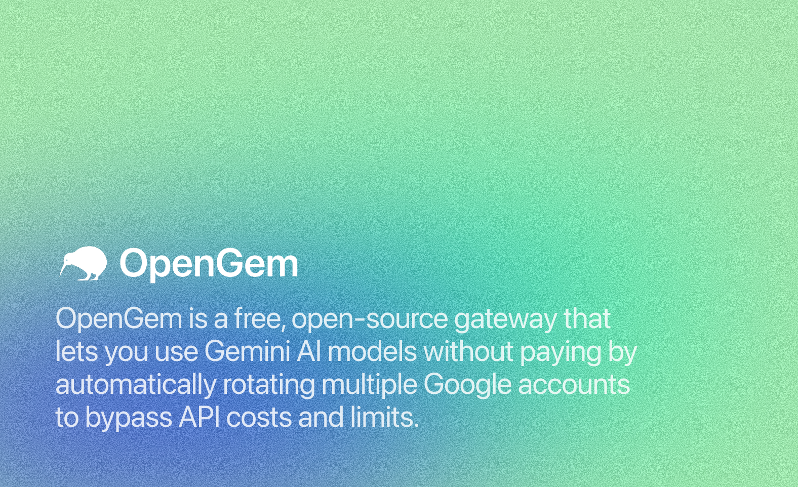
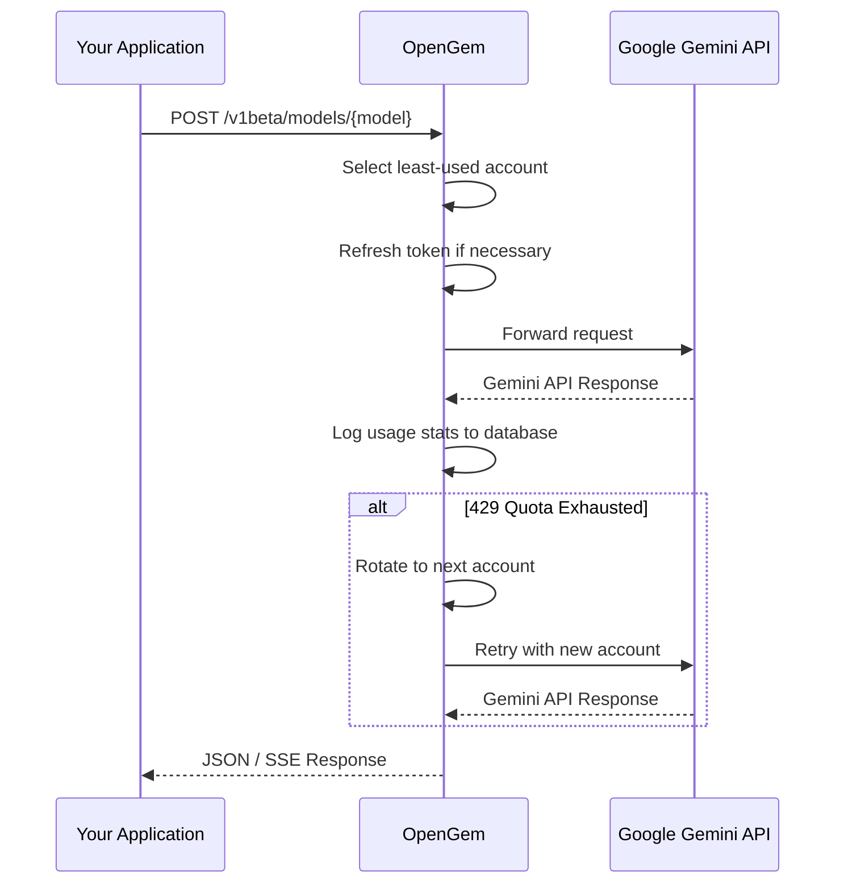

<div align="center">

<picture>
  <source media="(prefers-color-scheme: dark)" srcset="public/logos/white.png">
  
</picture>

# OpenGem 0.3.1

**Free, Open-Source AI API Gateway with Gemini, OpenAI & Anthropic Compatibility**

[](https://github.com/arifozgun/OpenGem/releases)
[](LICENSE)
[](https://nodejs.org)
[](https://typescriptlang.org)

Transform any standard **Google Account** into a free AI API endpoint. OpenGem utilizes Gemini CLI-compatible credentials to access Google's free-tier Gemini API, providing a standard `POST /v1beta/models/{model}:generateContent` interface that works natively with official Google Gen AI SDKs.

[Quick Start](#quick-start) · [How It Works](#how-it-works) · [API Usage](#api-usage) · [Admin Dashboard](#admin-dashboard)

</div>

---

## What is OpenGem?

OpenGem is an open-source proxy and API gateway designed to grant developers free, load-balanced access to Google's Gemini models. By operating an intelligent multi-account load balancer, OpenGem seamlessly handles rate limits and quota 429 exhaustions, automatically rotating active Google accounts to ensure uninterrupted service.

<div align="center">

</div>

## Core Features

| Feature | Description |
|---------|-------------|
| **Autonomous Agent Acceleration** | Optimized for tools like Claude Code with global Keep-Alive connection pooling and automatic zlib/gzip payload compression, reducing upload times by ~80% and eliminating TLS handshake latency. |
| **Completely Free Access** | Leverages Google's free-tier Gemini API using official CLI-equivalent authentication. |
| **Smart Load Balancing** | Automatically rotates across multiple Google accounts with exponential backoff, jitter, client-side rate limiting, and concurrency control. |
| **Standardized API** | Native `v1beta` models endpoint compatibility. Works perfectly with `@google/genai` and `google-genai` SDKs. |
| **Function Calling** | Full support for native Gemini `tools` and `toolConfig`, enabling AI agents and complex tool architectures. |
| **Real-time Streaming** | True Server-Sent Events (SSE) response streaming with automatic account rotation and model fallback (Flash → Pro). |
| **Pro Account Detection**| Automatically detects Google One AI Pro accounts during setup/refresh and assigns a "PRO" badge in the dashboard. |
| **Dynamic API Keys** | Generate and manage multiple API keys securely from the admin dashboard. |
| **Usage Dashboard** | Real-time statistics, account performance monitoring, and detailed request log tracking. |
| **Chat Playground** | Interactive dashboard console to test advanced models natively, adjust system prompts, and visualize thought process streams with Markdown support. |
| **One-Click Setup** | Intuitive, browser-based setup wizard requiring no manual configuration files. |
| **Secure by Default** | Built with JWT authentication, rate limiting, and Helmet.js security headers. |
| **Intelligent Self-Healing** | Accounts never permanently exhaust. Rate limits trigger escalating cooldowns (15s→120s) with automatic probe recovery, inspired by openclaw’s architecture. |
| **Flexible Database** | Choose between zero-configuration Firebase Firestore or a completely offline Local JSON database, toggleable on the fly in Settings. |

<div align="center">

https://github.com/user-attachments/assets/40051423-328d-412c-a1ac-066c343207df

</div>

---

## Quick Start

### Prerequisites
- [Node.js](https://nodejs.org) v18 or higher
- At least one active Google account
- (Optional) A [Firebase](https://console.firebase.google.com) project (if you choose the Firebase backend)

### Installation

```bash
# Clone the OpenGem repository
git clone https://github.com/arifozgun/OpenGem.git
cd opengem

# Install project dependencies
npm install

# Start the development server
npm run dev
```

Navigate to `http://localhost:3050` in your web browser. The **Setup Wizard** will automatically guide you through:
1. **Database Configuration** — Choose between Local JSON storage or Firebase Firestore.
2. **Admin Account** — Create your dashboard administrator login.
3. **API Key Generation** — Your first operational API key will be generated instantly.


### Firebase Setup Guide (Optional)

*If you choose the Firebase database backend during setup:*
1. Navigate to the [Firebase Console](https://console.firebase.google.com).
2. Create a new project or select an existing one.
3. Go to **Project Settings** > **General** and scroll down to the **Your apps** section.
4. Click **Add app** and select the **Web** (`</>`) platform.
5. Copy the provided Firebase configuration object.
6. Navigate to **Firestore Database**, click **Create database**, and initialize it in **test mode**.
7. Paste the configuration object into the OpenGem Setup Wizard.

---

## How It Works


```mermaid
sequenceDiagram
    participant App as Your Application
    participant OG as OpenGem
    participant API as Google Gemini API

    App->>OG: POST /v1beta/models/{model}
    OG->>OG: Select least-used account
    OG->>OG: Refresh token if necessary
    OG->>API: Forward request
    API-->>OG: Gemini API Response
    OG->>OG: Log usage stats to database

    alt 429 Quota Exhausted
        OG->>OG: Rotate to next account
        OG->>API: Retry with new account
        API-->>OG: Gemini API Response
    end

    OG-->>App: JSON / SSE Response
```

### Multi-Account Load Balancing

OpenGem dynamically manages a pool of authenticated Google accounts with a multi-layered stability system inspired by [openclaw](https://github.com/mariozechner/openclaw). When a 429 error occurs, the system classifies it (rate limit vs. quota exhaustion) and applies the appropriate strategy: temporary cooldowns with escalating durations and automatic probe recovery — accounts are **never** permanently deactivated. Concurrent API requests are throttled via a semaphore (max 3), inter-account delays prevent IP-level rate limiting, and exponential backoff with jitter eliminates thundering herd problems.

### Authentication Methodology

This project utilizes the identical OAuth credentials deployed by the official [Gemini CLI](https://github.com/google-gemini/gemini-cli) to authenticate with Google's cloud services. Consequently, each connected Google account inherits a project provisioning access to premier Gemini models.

---

## API Usage Reference

> **Large Payload Support:** The API gateway limit has been increased to `50mb`, allowing for exceptionally large contexts, massive document processing, and complex tool arrays.

### Endpoint URLs

```text
POST /v1beta/models/{model}:generateContent
POST /v1beta/models/{model}:streamGenerateContent
```

### Authentication Methods

You can authenticate utilizing standard convention:
```text
x-goog-api-key: your-api-key-here
```
Or via Bearer token format:
```text
Authorization: Bearer your-api-key-here
```

### Code Examples

**cURL**
```bash
curl -X POST "http://localhost:3050/v1beta/models/gemini-3.1-pro-preview:generateContent?key=your-api-key-here" \
  -H "Content-Type: application/json" \
  -d '{
    "contents": [{
      "parts": [{"text": "Explain quantum computing in one paragraph"}]
    }]
  }'
```

**Python (google-genai)**
```python
from google import genai

client = genai.Client(
    api_key="your-api-key-here",
    http_options={'api_version': 'v1beta', 'url': 'http://localhost:3050'}
)

response = client.models.generate_content(
    model="gemini-3.1-pro-preview",
    contents="Hello! What can you do?",
)

print(response.text)
```

**JavaScript (@google/genai)**
```javascript
import { GoogleGenAI } from '@google/genai';

const ai = new GoogleGenAI({
  apiKey: 'your-api-key-here',
  baseUrl: 'http://localhost:3050',
});

// Standard completion
const response = await ai.models.generateContent({
  model: 'gemini-3.1-pro-preview',
  contents: 'Hello! What can you do?'
});
console.log(response.text);

// Streaming completion
const stream = await ai.models.generateContentStream({
  model: 'gemini-3.1-pro-preview',
  contents: 'Tell me a long story.'
});
for await (const chunk of stream) {
  process.stdout.write(chunk.text());
}
```

**LangChain (Python)**
```python
from langchain_google_genai import ChatGoogleGenerativeAI

llm = ChatGoogleGenerativeAI(
    google_api_key="your-api-key-here",
    client_options={"client_cert_source": None, "api_endpoint": "http://localhost:3050"},
    model="gemini-3.1-pro-preview"
)

response = llm.invoke("What is the meaning of life?")
print(response.content)
```

---

## OpenAI & Anthropic Compatibility

OpenGem also exposes the **OpenAI Chat Completions** and **Anthropic Messages** wire formats so existing SDKs and tools (LangChain, LlamaIndex, OpenWebUI, Cline, Cursor, Anthropic SDKs, etc.) work out of the box. Requests are translated transparently to Gemini behind the scenes — multi-account rotation, fallbacks, cooldowns and streaming all behave identically.

### Endpoint URLs

```text
POST /v1/chat/completions   # OpenAI compatible (streaming + non-streaming)
GET  /v1/models             # OpenAI model list
POST /v1/messages           # Anthropic Messages compatible (streaming + non-streaming)
```

### Authentication

All four conventions are accepted on every endpoint:

| Header / Param            | SDK family          |
|---------------------------|---------------------|
| `Authorization: Bearer …` | OpenAI / Gemini SDK |
| `x-api-key: …`            | Anthropic SDK       |
| `x-goog-api-key: …`       | Gemini SDK          |
| `?key=…`                  | Gemini query string |

### Model Aliasing

Any model id starting with `gemini-` is passed through to Gemini directly. Common OpenAI / Anthropic model names (e.g. `gpt-4o`, `claude-3-5-sonnet-latest`) are transparently mapped onto your configured default Gemini model — the requested model id is preserved in every response and stream chunk so downstream code sees what it expects.

### OpenAI SDK (Python)

```python
from openai import OpenAI

client = OpenAI(
    api_key="your-api-key-here",
    base_url="http://localhost:3050/v1",
)

# Non-streaming
resp = client.chat.completions.create(
    model="gpt-4o",   # transparently routed to Gemini
    messages=[{"role": "user", "content": "Explain SSE in one paragraph."}],
)
print(resp.choices[0].message.content)

# Streaming
stream = client.chat.completions.create(
    model="gpt-4o",
    messages=[{"role": "user", "content": "Tell me a long story."}],
    stream=True,
)
for chunk in stream:
    delta = chunk.choices[0].delta.content or ""
    print(delta, end="", flush=True)
```

### OpenAI SDK (Node.js)

```javascript
import OpenAI from "openai";

const client = new OpenAI({
  apiKey: "your-api-key-here",
  baseURL: "http://localhost:3050/v1",
});

const stream = await client.chat.completions.create({
  model: "gpt-4o",
  messages: [{ role: "user", content: "Hello, who are you?" }],
  stream: true,
  stream_options: { include_usage: true },
});

for await (const chunk of stream) {
  process.stdout.write(chunk.choices[0]?.delta?.content ?? "");
}
```

### Anthropic SDK (Python)

```python
from anthropic import Anthropic

client = Anthropic(
    api_key="your-api-key-here",
    base_url="http://localhost:3050",
)

# Non-streaming
msg = client.messages.create(
    model="claude-3-5-sonnet-latest",   # transparently routed to Gemini
    max_tokens=1024,
    messages=[{"role": "user", "content": "Summarize the theory of relativity."}],
)
print(msg.content[0].text)

# Streaming
with client.messages.stream(
    model="claude-3-5-sonnet-latest",
    max_tokens=1024,
    messages=[{"role": "user", "content": "Write a haiku about Gemini."}],
) as stream:
    for text in stream.text_stream:
        print(text, end="", flush=True)
```

### Anthropic SDK (Node.js)

```javascript
import Anthropic from "@anthropic-ai/sdk";

const client = new Anthropic({
  apiKey: "your-api-key-here",
  baseURL: "http://localhost:3050",
});

const stream = client.messages.stream({
  model: "claude-3-5-sonnet-latest",
  max_tokens: 1024,
  messages: [{ role: "user", content: "Explain neural networks briefly." }],
});

for await (const event of stream) {
  if (event.type === "content_block_delta" && event.delta.type === "text_delta") {
    process.stdout.write(event.delta.text);
  }
}
```

### Feature Coverage

| Feature                         | OpenAI `/v1/chat/completions` | Anthropic `/v1/messages` |
|---------------------------------|:-----------------------------:|:------------------------:|
| Streaming (SSE)                 | ✅                            | ✅                       |
| Tool / function calling         | ✅                            | ✅                       |
| Tool result messages            | ✅                            | ✅                       |
| Multi-modal (base64 images)     | ✅                            | ✅                       |
| System messages / `system`      | ✅                            | ✅                       |
| `temperature`, `top_p`, `stop`  | ✅                            | ✅                       |
| `response_format: json_object`  | ✅                            | —                        |
| `top_k`                         | —                             | ✅                       |
| Usage stats in response         | ✅                            | ✅                       |
| Usage stats in stream           | ✅ (`include_usage`)          | ✅ (`message_delta`)     |

> **Security note:** OpenAI / Anthropic endpoints share the same hashed API-key store, the same per-IP rate limiter (120 req/min), and the same `requireApiKey` validation as the Gemini proxy. Auth errors are returned in each protocol's native error envelope so SDKs can surface them correctly.

---

## Admin Dashboard

After completing the initial setup, access the administrative panel at `http://localhost:3050`.

### Core Capabilities

| Dashboard Panel | Capabilities |
|-----------------|--------------|
| **Overview** | Analyze total proxy requests, success rates, active account statuses, and system-wide token usage. |
| **Accounts** | Connect new Google accounts via secure OAuth, automatically detect Pro status, monitor current status, and manually reactivate if necessary. |
| **API Keys** | Issue new API keys, revoke existing ones, and monitor individual key bandwidth utilization. |
| **Chat** | Interactive playground supporting Gemini 3 Pro thought processes, customizable system instructions, and real-time Markdown streaming. |
| **Settings** | Toggle between Firebase and Local JSON database solutions on the fly without losing request logs or account data. |
| **Logs** | Access comprehensive chronological histories detailing requests, generated completions, formatted tool calls (`functionCall`/`functionResponse`), and token calculations. |

### Connecting Google Accounts

1. Log in securely to the admin dashboard.
2. Navigate to **Accounts** and select **Connect Account**.
3. Authenticate with an active Google account and grant the requested permissions.
4. OpenGem immediately integrates the account into its active load-balanced rotation pool.

> **Optimization Tip:** Connect multiple Google accounts to linearly scale your available free quota. Google allocates individual free-tier quotas strictly on a per-account basis.


---

## Security Architecture

### Authentication & Access Control
- **JWT Authentication** — Admin sessions use cryptographically signed JSON Web Tokens with a secure 12-hour expiry. Tokens are stored in `httpOnly`, `secure`, `sameSite: strict` cookies to prevent XSS and CSRF attacks.
- **Bcrypt Password Hashing** — Admin credentials (both username and password) are hashed with bcrypt (cost factor 12). Plaintext passwords are never stored.
- **Password Complexity** — Enforced minimum 8 characters with at least one uppercase letter, one lowercase letter, and one digit, validated on both client and server side.
- **Rate Limiting** — Login attempts are limited to 5 per 15 minutes per IP. API requests are capped at 120 per minute per IP to prevent brute force and DoS attacks.

### Data Encryption
- **AES-256-GCM Config Encryption** — All sensitive values in `config.json` (Firebase keys, JWT secret) are encrypted at rest using AES-256-GCM with scrypt key derivation. The encryption key is stored exclusively in `.env`.
- **OAuth Token Encryption** — Google OAuth access tokens and refresh tokens are encrypted with AES-256-GCM before being written to Firestore, ensuring tokens remain protected even if the database is compromised.
- **API Key Hashing** — API keys are stored as SHA-256 hashes in Firestore. Only a 7-character prefix is retained for display purposes. Plaintext keys are shown only once at creation time and are never stored.

### Network & Transport Security
- **CORS Restriction** — Cross-origin requests are blocked in production by default. Allowed origins can be configured via the `CORS_ORIGIN` environment variable.
- **Helmet.js Integration** — Comprehensive HTTP security headers including strict Content Security Policy (CSP), X-Frame-Options, and XSS protection.
- **OAuth CSRF Protection** — OAuth flows use separate cryptographic state parameters (`crypto.randomBytes`) independent from PKCE code verifiers, preventing CSRF and state-leakage attacks.

### Operational Security
- **Error Message Masking** — Internal error details (stack traces, file paths) are hidden from API responses in production. Only generic error messages are returned to clients.
- **Environment Isolation** — Sensitive credentials (`.env`, `config.json`) are gitignored. The `.htaccess` file blocks direct access to sensitive files and directories on production servers.
- **Auto-Migration** — Legacy plaintext API keys and unencrypted config values are automatically detected and migrated to their secure formats on first use.

---

## Project Structure

```text
opengem/
├── public/
│   ├── icons/           # Third-party provider icons (Google, Firebase, Gemini)
│   ├── logos/
│   │   ├── black.png    # Logo for light backgrounds
│   │   └── white.png    # Logo for dark backgrounds
│   ├── index.html       # Admin dashboard interface
│   ├── admin.css        # Interactive dashboard styling
│   ├── admin.js         # Client-side dashboard logic
│   ├── setup.html       # Configuration wizard interface
│   ├── setup.css        # Wizard styling architecture
│   ├── setup.js         # Wizard operational logic
│   └── robots.txt       # Search engine crawler directives
├── src/
│   ├── index.ts         # High-level Express server, automated routing
│   ├── controllers/
│   │   ├── chat.ts        # Gemini engine: rotation, retry, sink-driven streaming
│   │   ├── openai.ts      # OpenAI /v1/chat/completions + /v1/models endpoints
│   │   └── anthropic.ts   # Anthropic /v1/messages endpoint
│   ├── middleware/
│   │   └── auth.ts      # JWT administrative authentication interceptors
│   └── services/
│       ├── adapters/
│       │   ├── openai.ts          # OpenAI ↔ Gemini request/response/stream translator
│       │   ├── anthropic.ts       # Anthropic ↔ Gemini request/response/stream translator
│       │   └── model-aliases.ts   # gpt-* / claude-* → Gemini model routing
│       ├── streaming.ts  # Pluggable StreamSink abstraction (Gemini / OpenAI / Anthropic)
│       ├── config.ts    # Centralized state management & AES-256 encryption
│       ├── database.ts  # Abstract database interface & backend factory
│       ├── firebase.ts  # Integrated Firestore schema operations
│       ├── gemini.ts    # Standardized Gemini API & OAuth connectors
│       ├── http.ts      # Native resilient HTTP client integration
│       ├── localDb.ts   # Local JSON file database backend
│       ├── retry.ts     # Exponential backoff with jitter retry utility
│       ├── rate-limiter.ts      # Per-account client-side rate limiter
│       ├── error-classifier.ts  # 8-category error classification system
│       ├── account-cooldown.ts  # Account cooldown with probe recovery
│       └── concurrency.ts      # Request concurrency semaphore limiter
├── .env.example         # Template environment variables
├── .htaccess            # Production file access restrictions
├── app.js               # Production entry point
├── config.json          # Encrypted runtime configuration (auto-generated)
├── nodemon.json         # Development hot-reload configuration
├── package.json
├── tsconfig.json
├── CODE_OF_CONDUCT.md   # Community code of conduct
├── CONTRIBUTING.md      # Contribution guidelines
├── SECURITY.md          # Security vulnerability reporting
└── LICENSE
```

---

## Advanced Deployment

### cPanel / Shared Node.js Hosting

1. Generate the production build: `npm run build`
2. Upload the compiled deployment artifact to your remote server architecture.
3. Configure the designated Node.js application within cPanel targeting `app.js`.
4. Access the designated domain to initialize the Setup Wizard securely.

### VPS / Docker Deployment

```bash
# Generate optimized production artifacts
npm run build

# Initialize production daemon
NODE_ENV=production npm start
```

Configure the `OAUTH_REDIRECT_URI` variable within your `.env` configuration mapping to the publicly resolved URL callback endpoint:
```text
OAUTH_REDIRECT_URI=https://yourdomain.com/api/auth/callback
```

---

## Open Source Contribution

Community engineering optimization is actively encouraged. Please read the [Contributing Guidelines](CONTRIBUTING.md) and [Code of Conduct](CODE_OF_CONDUCT.md) before submitting changes.

1. Fork the OpenGem repository.
2. Formulate a discrete feature branch: `git checkout -b feature/architectural-enhancement`
3. Commit optimizations: `git commit -m 'Implement architectural enhancement'`
4. Push remote branches: `git push origin feature/architectural-enhancement`
5. Submit a comprehensive Pull Request.

For security vulnerabilities, please refer to our [Security Policy](SECURITY.md).

### Roadmap & Pipeline
- Docker Compose ecosystem orchestration
- Webhook notifications for granular quota alerting
- Per-API Key differential rate limiting overrides
- Redis integrated response payload caching

---

## License Summary

This repository is distributed under the [MIT License](LICENSE).

---

## Disclaimer

> [!CAUTION]
> **This project is intended strictly for educational purposes, personal research, and learning.**

OpenGem is a proof-of-concept project that demonstrates API gateway architecture, multi-account load balancing, and OAuth authentication patterns. It utilizes authentication flows consistent with Google's open-source [Gemini CLI](https://github.com/google-gemini/gemini-cli) project.

**By using this software, you acknowledge that:**

- This project is provided **as-is** for educational and research purposes only.
- You are solely responsible for ensuring your usage complies with [Google's Terms of Service](https://policies.google.com/terms).
- This project is **not intended for commercial or production use**.
- The authors and contributors assume **no liability** for any consequences arising from the use of this software.
- This project has **no official affiliation, endorsement, or sponsorship** from Google LLC or any of its subsidiaries.

**If you are looking for production-ready Gemini API access, please use the official [Google AI Studio](https://aistudio.google.com) or [Google Cloud Vertex AI](https://cloud.google.com/vertex-ai).**

---

## Star History

[](https://www.star-history.com/#arifozgun/OpenGem&type=date&legend=top-left)

---

<div align="center">

**If OpenGem scaled your AI development efficiently, please consider giving it a ⭐ on GitHub!**

Maintained by the global open-source community.

</div>
